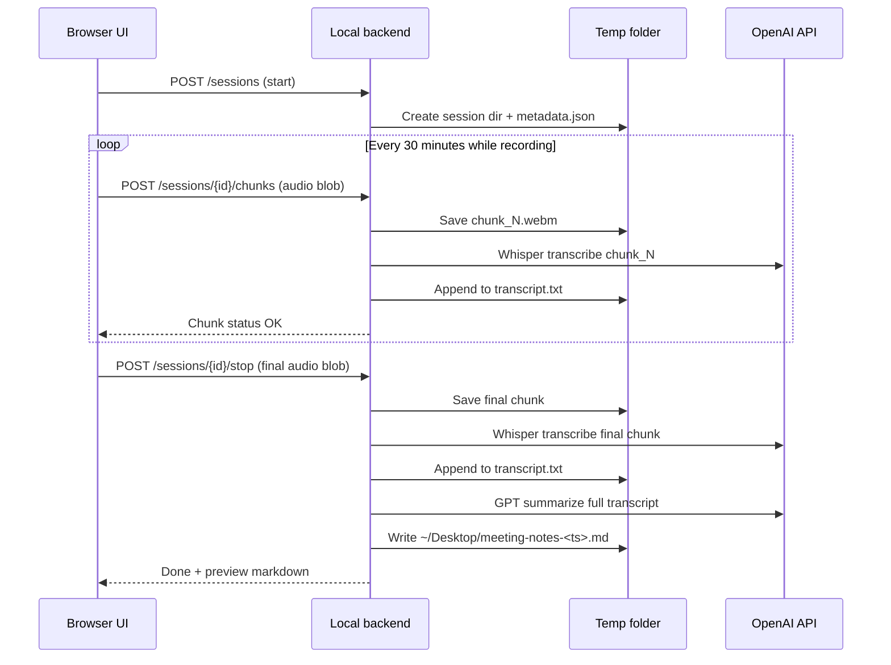

# Afterword — Meeting Voice Recorder & Summarizer

Architecture and implementation plan for review before building v1.

## Overview

**Afterword** is a simple local web app that records meetings, transcribes them with OpenAI Whisper, summarizes the transcript with a small GPT model, and saves a markdown file to the user's Desktop.

The app runs entirely on the user's machine: a browser UI for recording controls and a local backend for transcription, summarization, and file output.

```
┌─────────────────────────────────────────────────────────────────┐
│  Browser UI (localhost)                                         │
│  ┌──────────────┐  ┌──────────────┐  ┌────────────────────────┐ │
│  │ In-person    │  │ Remote       │  │ Start / Stop / Status  │ │
│  │ mode (mic)   │  │ mode (sys)   │  │                        │ │
│  └──────┬───────┘  └──────┬───────┘  └───────────┬────────────┘ │
│         │                 │                      │              │
│         └────────┬────────┘                      │              │
│                  ▼                               │              │
│         MediaRecorder (WebM/Opus)                │              │
│                  │                               │              │
│         Chunk upload every 30 min ───────────────┼──────────────┤
│         Final upload on stop ────────────────────┘              │
└─────────────────────────────────────────────────────────────────┘
                                   │
                                   ▼
┌─────────────────────────────────────────────────────────────────┐
│  Local backend (localhost)                                      │
│                                                                 │
│  1. Receive audio chunks → temp storage on disk                 │
│  2. Transcribe each chunk (Whisper API) → append to transcript  │
│  3. On stop: transcribe remainder → finalize transcript file    │
│  4. Send full transcript to GPT → markdown summary              │
│  5. Write ~/Desktop/meeting-notes-<timestamp>.md                │
└─────────────────────────────────────────────────────────────────┘
```

---

## Goals (v1)

| Goal | Approach |
|------|----------|
| Record on demand | Start / Stop controls in browser |
| Work when tab is unfocused | `MediaRecorder` + Screen Wake Lock during session |
| In-person meetings | Microphone capture (`getUserMedia`) |
| Remote meetings | System / tab audio capture (see [Recording modes](#recording-modes)) |
| Long meetings | 30-minute chunking with incremental transcription |
| Transcription | OpenAI Whisper API (`whisper-1`) |
| Summarization | OpenAI chat completions (configurable small model) |
| Output | Markdown file written directly to Desktop by backend |
| API key security | Key stored in `.env`, never sent to browser |

## Non-goals (v1)

- Local / offline models (planned for v2)
- User accounts or cloud hosting
- Persistent meeting history database
- Speaker diarization (who said what)
- Mobile support

---

## Tech stack

| Layer | Choice | Rationale |
|-------|--------|-----------|
| Frontend | Vite + vanilla JS (or minimal React) | Fast to build, no heavy framework needed |
| Backend | Python + FastAPI | Simple async API; easy to add local Whisper in v2 |
| Audio format | WebM with Opus (browser default) | Good compression; backend can convert if needed |
| Transcription | OpenAI Whisper API | Reliable quality for meetings |
| Summarization | OpenAI API (env-configurable model) | Swap models without code changes |
| Config | `.env` file | `OPENAI_API_KEY`, model names, paths |

### Suggested project layout

```
afterword/
├── frontend/          # Vite app — recording UI
├── backend/           # FastAPI app — transcription, summary, file I/O
├── docs/
│   └── PLAN.md        # This file
├── .env.example       # Template for required env vars
└── README.md          # How to run
```

---

## Recording modes

### Mode 1: In-person (microphone)

**Capture source:** `navigator.mediaDevices.getUserMedia({ audio: true })`

- Records ambient audio via the default or selected microphone.
- Straightforward, works on all platforms.
- **Included in v1** — primary mode.

### Mode 2: Remote (machine audio)

**Capture source:** System or application audio from the machine, not just the mic.

**Important constraint:** Browsers do not offer a single cross-platform API for "record all system audio." Options vary by OS and browser:

| Approach | Pros | Cons |
|----------|------|------|
| **Tab capture** (`getDisplayMedia` with `audio: true` on a browser tab) | Works in Chrome; captures Zoom/Meet/Teams if run in browser | Only captures that tab; desktop apps not covered |
| **Screen share + system audio** (Chrome on Windows) | Can include system audio checkbox | Windows + Chrome only; user must pick screen |
| **Virtual audio cable** (e.g. BlackHole, VB-Cable) + mic mode | Captures any app audio | Requires OS-level setup; poor UX for v1 |
| **Desktop wrapper** (Tauri/Electron) | Full system audio APIs | Heavier; not a "simple web app" |

**Recommendation for v1:**

1. **Ship Mode 1 (mic) first** — fully reliable.
2. **Add Mode 2 as "Remote (tab audio)"** if feasible in the first pass: user selects the meeting tab via `getDisplayMedia`. Covers browser-based calls with minimal extra complexity.
3. **Defer true system-wide capture** (desktop Zoom/Teams apps, all speakers) to v1.1 or a Tauri wrapper unless target OS is known and a single approach is acceptable.

If Mode 2 proves too brittle during implementation, v1 ships with mic-only and documents how to use a virtual cable as a workaround.

---

## Audio chunking & transcription pipeline

Long meetings are handled by transcribing in **30-minute increments** while recording continues. Text accumulates on disk; summarization runs once at the end.

### Session lifecycle



### Chunking rules

- **Chunk interval:** 30 minutes of recording time (configurable via env, default `1800` seconds).
- **Chunk trigger:** Frontend starts a timer on record; at each interval, `MediaRecorder` is stopped briefly, blob uploaded, then a new `MediaRecorder` starts on the same stream (or use `timeslice` if continuous blobs are acceptable — implementation detail).
- **Final chunk:** Whatever remains when the user hits Stop (may be shorter than 30 minutes).
- **Whisper limit:** 25 MB per file. 30 minutes of Opus WebM is typically well under this; backend should still validate size and error clearly if exceeded.

### Temp storage on disk

Each recording session gets an isolated directory:

```
/tmp/afterword/sessions/<session-id>/
├── metadata.json       # start time, mode, chunk count, status
├── chunk_001.webm
├── chunk_002.webm
├── ...
├── transcript.txt      # growing plain-text transcript (appended per chunk)
└── summary.md          # written only after final summarization (optional copy)
```

- **Transcript file:** Plain text, chunks separated by a delimiter (e.g. `\n\n---\n\n`) so order is preserved.
- **Cleanup:** Delete session temp dir after successful Desktop write (or after 24h TTL as a safety net).
- **Failure recovery:** If the app crashes mid-meeting, temp files remain; v1 can document manual recovery from `transcript.txt` + remaining chunks. Automatic resume is out of scope for v1.

### Summarization (end of session only)

After the final chunk is transcribed and appended:

1. Read full `transcript.txt` from disk.
2. Send to OpenAI chat completions with a structured prompt.
3. Write result to Desktop (see [Output format](#output-format)).
4. Return markdown preview to the UI.

Summarization is **not** run per chunk — only once on the complete transcript — to keep context coherent and costs predictable.

---

## Backend API (draft)

| Method | Path | Description |
|--------|------|-------------|
| `GET` | `/api/health` | Health check |
| `POST` | `/api/sessions` | Start session `{ "mode": "in_person" \| "remote" }` → `{ "sessionId" }` |
| `POST` | `/api/sessions/{id}/chunks` | Upload audio chunk (multipart) → transcribe → append transcript |
| `POST` | `/api/sessions/{id}/stop` | Upload final chunk → transcribe → summarize → save Desktop file |
| `GET` | `/api/sessions/{id}/status` | `{ chunksReceived, transcriptLength, state }` |

All endpoints are localhost-only; no authentication required for v1.

---

## Output format

Files written to **`~/Desktop/`** (configurable via `OUTPUT_DIR` in `.env`):

**Filename:** `meeting-notes-YYYY-MM-DD-HHmm.md`

**Structure:**

```markdown
# Meeting notes — YYYY-MM-DD HH:mm

## Summary
...

## Key decisions
- ...

## Action items
- [ ] ...

## Discussion highlights
...

---

## Full transcript
...
```

Whether to include the full transcript in the same file or as a separate `_transcript.md` is an open question (see below). Default: include in the same file under a collapsible-style section (markdown heading), so one file opens in any note app.

---

## Configuration (`.env`)

```env
OPENAI_API_KEY=sk-...
OPENAI_WHISPER_MODEL=whisper-1
OPENAI_SUMMARY_MODEL=gpt-4.1-mini    # or preferred small model; configurable
CHUNK_INTERVAL_SECONDS=1800
OUTPUT_DIR=~/Desktop
TEMP_DIR=/tmp/afterword/sessions
HOST=127.0.0.1
PORT=8000
```

Frontend dev server proxies `/api` to the backend, or CORS is enabled for `localhost` only.

---

## Frontend UX (v1)

1. **Mode selector:** In-person | Remote (tab audio) — Remote disabled with tooltip if not supported on current browser/OS.
2. **Record button:** Starts session, requests mic/tab permission, begins timer and chunk schedule.
3. **Status line:** Recording duration, chunks sent, "Transcribing chunk 2…" when uploading.
4. **Stop button:** Ends recording, shows progress: transcribing → summarizing → done.
5. **Completion:** "Saved to Desktop: meeting-notes-….md" + short preview of the Summary section.
6. **Wake Lock:** Request screen wake lock while recording to reduce sleep-related drops.

---

## Reliability & error handling

| Scenario | Behavior |
|----------|----------|
| Mic / tab permission denied | Block start; show clear instructions |
| Chunk upload fails | Retry 2–3 times; show error; keep recording locally in browser until retry succeeds |
| Whisper API error | Keep audio chunk on disk; surface error; do not delete session |
| Summarization API error | Transcript still on disk; write transcript-only markdown to Desktop as fallback |
| Empty / silent audio | Skip Whisper call; warn user |
| Browser tab closed mid-recording | Recording stops; partial chunks on disk may be recoverable manually |

---

## Privacy & cost

- **v1:** Audio and text are sent to OpenAI servers. User must accept this for v1.
- **v2 (future):** Swap Whisper → local `faster-whisper` (or similar) and GPT → local LLM via Ollama; backend interface designed so providers are pluggable.
- **Cost (rough):** Whisper ~$0.006/min; summary scales with transcript tokens. A 1-hour meeting is typically cents to low tens of cents depending on summary model.

---

## Future (v2) — local models

Design the backend with a thin **provider abstraction**:

```python
# Conceptual — not implementation yet
class TranscriptionProvider(Protocol):
    async def transcribe(self, audio_path: Path) -> str: ...

class SummarizationProvider(Protocol):
    async def summarize(self, transcript: str) -> str: ...
```

v1 implements `OpenAITranscriptionProvider` and `OpenAISummarizationProvider`. v2 adds `LocalWhisperProvider` and `OllamaSummarizationProvider` selected via env (`TRANSCRIPTION_PROVIDER=openai|local`).

No v1 work beyond this interface shape — avoid over-engineering, but don't hard-code OpenAI calls in every route.

---

## Implementation phases

### Phase 1 — Core loop (mic only)

- Backend: session create, single upload, Whisper, GPT, Desktop write
- Frontend: record → stop → wait → done
- No chunking yet; validates end-to-end pipeline

### Phase 2 — Chunking & long meetings

- 30-minute chunk upload from frontend
- Incremental transcription append to `transcript.txt`
- Final summarize on complete transcript

### Phase 3 — Remote mode (if feasible)

- Tab audio capture via `getDisplayMedia`
- Mode toggle in UI
- Platform detection + fallback messaging

### Phase 4 — Polish

- Wake Lock, retries, fallback markdown on summary failure
- `.env.example`, README, basic error states

---

## Open questions (for your review)

Please confirm or adjust before implementation:

1. **Target OS:** Linux, macOS, Windows, or all three? Remote/tab audio behavior depends heavily on this (macOS is the most restrictive for system audio).

2. **Remote mode scope for v1:** Is **browser tab audio** acceptable for "remote" (user shares the Meet/Zoom tab), or do you need **desktop app audio** (Zoom/Teams native apps) in v1?

3. **Transcript in output file:** Include full transcript in the same markdown file, or summary-only with transcript saved separately?

4. **Summary model:** Any preference for the OpenAI model name (e.g. `gpt-4.1-mini`, `gpt-4o-mini`)? Plan uses env var so you can change it anytime.

5. **Meeting title:** Should the UI prompt for an optional meeting title (used in filename and H1), or auto-generate from timestamp only?

6. **Temp dir location:** Default `/tmp/afterword/sessions` OK, or prefer something under the project directory (e.g. `~/.afterword/sessions`)?

---

## Risks summary

| Risk | Mitigation |
|------|------------|
| System audio not capturable in pure web app | Tab audio for v1; document virtual cable; Tauri later |
| Background tab throttling | Wake Lock; user keeps browser open |
| Long transcript exceeds GPT context | Truncate with warning, or map-reduce summarize in chunks (v1.1) |
| 25 MB Whisper limit per chunk | 30-min chunks stay small; backend validates size |

---

## Decision log

| Decision | Choice |
|----------|--------|
| Deployment | Local only (`127.0.0.1`) |
| Transcription provider (v1) | OpenAI Whisper API |
| Summarization provider (v1) | OpenAI API |
| Chunk interval | 30 minutes |
| Transcript storage during session | Temp folder on disk, appended per chunk |
| Summarization timing | Once, after full transcript is ready |
| Desktop output | Backend writes directly to `~/Desktop` |
| Local models | Deferred to v2 with provider abstraction |

---

*Document version: 1.0 — pending review before implementation.*
