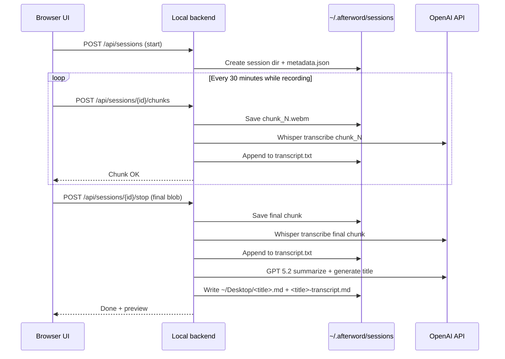

# Afterword — Meeting Voice Recorder & Summarizer

Architecture and phased implementation plan for **v1 on macOS**.

## Overview

**Afterword** is a local web app that records meetings via the microphone, transcribes them with OpenAI Whisper, summarizes the transcript with GPT, and saves two markdown files to the user's Desktop: a summary note and a separate full transcript.

```
┌─────────────────────────────────────────────────────────────────┐
│  Browser UI (localhost) — Chrome or Safari on macOS             │
│                                                                 │
│  ┌────────────────────────────────────────────────────────────┐ │
│  │  Mic recording  ·  Start / Stop  ·  Status / timer       │ │
│  └────────────────────────────┬───────────────────────────────┘ │
│                               ▼                                 │
│                    MediaRecorder (WebM/Opus)                    │
│                               │                                 │
│         Chunk upload every 30 min (while recording)             │
│         Final upload on stop                                    │
└───────────────────────────────┼─────────────────────────────────┘
                                ▼
┌─────────────────────────────────────────────────────────────────┐
│  Local backend (127.0.0.1)                                      │
│                                                                 │
│  1. Receive audio chunks → ~/.afterword/sessions/<id>/        │
│  2. Transcribe each chunk (Whisper) → append transcript.txt   │
│  3. On stop: transcribe remainder → finalize transcript       │
│  4. Summarize full transcript (GPT 5.2) → title + notes     │
│  5. Write two files to ~/Desktop/                               │
└─────────────────────────────────────────────────────────────────┘
```

---

## Confirmed decisions (v1)

| Topic | Decision |
|-------|----------|
| Target platform | **macOS** (Chrome or Safari) |
| Recording input | **Microphone only** — no remote/system audio in v1 |
| Chunk interval | 30 minutes |
| Transcription | OpenAI Whisper API (`whisper-1`) |
| Summarization | OpenAI API — **`gpt-5.2`** |
| Meeting title | **Generated by the summarizer** from transcript content |
| Output location | Backend writes directly to **`~/Desktop/`** |
| Output files | **Two files:** summary markdown + separate transcript markdown |
| Session temp storage | **`~/.afterword/sessions/<session-id>/`** |
| API key | `.env` on the machine; never exposed to the browser |
| Local models | Deferred to **v2** |

## Goals (v1)

| Goal | Approach |
|------|----------|
| Record on demand | Start / Stop controls in browser |
| Work when tab is unfocused | `MediaRecorder` + Screen Wake Lock during session |
| In-person meetings | Microphone via `getUserMedia` |
| Long meetings | 30-minute chunking with incremental transcription |
| Transcription | OpenAI Whisper API |
| Summarization | GPT 5.2 with structured output including title |
| Output | Two markdown files on Desktop (summary + transcript) |

## Non-goals (v1)

- Remote / system / tab audio capture (future version)
- Local / offline models (v2)
- Linux or Windows support
- User accounts, cloud hosting, or meeting history database
- Speaker diarization
- Mobile support

---

## Tech stack

| Layer | Choice | Rationale |
|-------|--------|-----------|
| Frontend | Vite + vanilla JS | Minimal; fast to build |
| Backend | Python + FastAPI | Async API; easy v2 local-model swap |
| Audio format | WebM/Opus (browser default) | Good compression on macOS browsers |
| Transcription | OpenAI Whisper API | Reliable meeting quality |
| Summarization | OpenAI GPT 5.2 | Per product decision |
| Config | `.env` | Keys, model names, paths |

### Project layout

```
afterword/
├── frontend/              # Vite app — recording UI
├── backend/
│   ├── app/
│   │   ├── main.py        # FastAPI routes
│   │   ├── config.py      # env loading
│   │   ├── providers/     # transcription + summarization protocols
│   │   └── sessions/      # session dir management, chunk I/O
│   └── requirements.txt
├── docs/
│   └── PLAN.md
├── .env.example
└── README.md
```

---

## Recording (mic only)

**Capture source:** `navigator.mediaDevices.getUserMedia({ audio: true })`

- Records via the default or user-selected microphone.
- User should grant mic permission when prompted (works on `localhost` without HTTPS).
- **macOS note:** If using an external mic, macOS System Settings → Sound → Input controls which device is captured when the browser requests the default input.

Remote/system audio is **out of scope for v1**. A future version may add tab capture or a desktop wrapper for Zoom/Teams app audio on macOS.

---

## Audio chunking & transcription pipeline

Long meetings are transcribed in **30-minute increments** while recording continues. Text accumulates on disk; summarization runs **once** when the user stops.

### Session lifecycle



### Chunking rules

- **Interval:** 30 minutes (configurable via `CHUNK_INTERVAL_SECONDS`, default `1800`).
- **Trigger:** Frontend timer; at each interval, stop `MediaRecorder`, upload blob, start a new recorder on the same stream.
- **Final chunk:** Remainder when the user hits Stop (may be &lt; 30 minutes).
- **Whisper limit:** 25 MB per file. Validate on the backend; 30 min Opus WebM should be well under this on macOS.

### Temp storage layout

```
~/.afterword/sessions/<session-id>/
├── metadata.json       # start time, chunk count, state, generated title (after stop)
├── chunk_001.webm
├── chunk_002.webm
├── ...
└── transcript.txt      # plain text, chunks separated by \n\n---\n\n
```

- **Cleanup:** Remove session dir after successful Desktop write, or after 24h TTL.
- **Crash recovery:** Temp files remain on disk; automatic resume is out of scope for v1 (document manual recovery in README).

### Summarization (end of session only)

1. Read full `transcript.txt`.
2. Call GPT 5.2 with a structured prompt that returns:
   - **`title`** — short, descriptive meeting title inferred from content (used for filenames and H1).
   - **`summary`** — body markdown (sections below).
3. Write two Desktop files (see [Output format](#output-format)).
4. Return preview JSON to the UI.

Summarization is **not** run per chunk.

---

## Backend API

| Method | Path | Description |
|--------|------|-------------|
| `GET` | `/api/health` | `{ "status": "ok" }` |
| `POST` | `/api/sessions` | Start session → `{ "sessionId" }` |
| `POST` | `/api/sessions/{id}/chunks` | Multipart audio chunk → transcribe → append transcript |
| `POST` | `/api/sessions/{id}/stop` | Final chunk → transcribe → summarize → write Desktop files |
| `GET` | `/api/sessions/{id}/status` | `{ "chunksReceived", "transcriptLength", "state" }` |

Bind to `127.0.0.1` only. No auth for v1.

---

## Output format

Both files written to **`~/Desktop/`** (override via `OUTPUT_DIR`).

**Filenames** (derived from summarizer-generated title, slugified):

| File | Example |
|------|---------|
| Summary | `q2-planning-sync.md` |
| Transcript | `q2-planning-sync-transcript.md` |

If title slugification collides with an existing file, append `-2`, `-3`, etc.

### Summary file (`<title>.md`)

```markdown
# Q2 Planning Sync

## Summary
...

## Key decisions
- ...

## Action items
- [ ] ...

## Discussion highlights
...
```

### Transcript file (`<title>-transcript.md`)

```markdown
# Q2 Planning Sync — Full Transcript

Recorded: 2026-06-24 14:30

---

[full transcript text]
```

The summary file does **not** include the full transcript.

---

## Configuration (`.env`)

```env
OPENAI_API_KEY=sk-...
OPENAI_WHISPER_MODEL=whisper-1
OPENAI_SUMMARY_MODEL=gpt-5.2
CHUNK_INTERVAL_SECONDS=1800
OUTPUT_DIR=~/Desktop
SESSION_DIR=~/.afterword/sessions
HOST=127.0.0.1
PORT=8000
```

Frontend dev server proxies `/api` → backend, or backend enables CORS for `http://localhost:<frontend-port>` only.

---

## Frontend UX (v1)

1. **Record** — requests mic permission, starts backend session, begins timer.
2. **Status** — elapsed time, chunks uploaded, processing states.
3. **Stop** — uploads final chunk; shows transcribing → summarizing → done.
4. **Done** — shows generated title and both Desktop filenames + short summary preview.
5. **Wake Lock** — requested while recording to reduce macOS sleep interruptions.

No mode selector in v1 (mic only).

---

## Reliability & error handling

| Scenario | Behavior |
|----------|----------|
| Mic permission denied | Block start; show macOS permission instructions |
| Chunk upload fails | Retry up to 3 times; keep recording; surface error if exhausted |
| Whisper API error | Retain audio chunk on disk; do not delete session |
| Summarization API error | Write transcript file to Desktop; show error for summary |
| Empty / silent audio | Skip Whisper; warn user |
| Tab closed mid-recording | Recording stops; partial data may exist in `~/.afterword/sessions` |

---

## Provider abstraction (v2-ready)

Keep OpenAI behind thin protocols; do not scatter API calls across routes.

```python
class TranscriptionProvider(Protocol):
    async def transcribe(self, audio_path: Path) -> str: ...

class SummarizationProvider(Protocol):
    async def summarize(self, transcript: str) -> SummarizedMeeting: ...
    # SummarizedMeeting: title: str, markdown_body: str
```

v1: `OpenAITranscriptionProvider`, `OpenAISummarizationProvider`.  
v2: local Whisper + Ollama implementations via env (`TRANSCRIPTION_PROVIDER`, `SUMMARIZATION_PROVIDER`).

---

## Privacy & cost

- **v1:** Audio and text sent to OpenAI servers.
- **Cost:** Whisper ~$0.006/min; GPT 5.2 cost scales with transcript length. Typical 1-hour meeting: low cost but non-zero.

---

## Implementation phases

Each phase ends with a **validation gate**. Before starting the next phase, spin up a **separate review agent** (different model/session) to:

1. Perform a **code review** of all changes merged for that phase.
2. Execute the **validation checklist** below and confirm every item passes.
3. Produce a short **gate report** (`docs/gates/phase-N-report.md`) with: pass/fail per item, review findings, and explicit **GO / NO-GO** for the next phase.

**Do not begin Phase N+1 until the Phase N gate report says GO.**

---

### Phase 1 — Foundation & project scaffolding

**Goal:** Runnable repo skeleton with backend config, session storage, and provider interfaces — no recording yet.

**Deliverables**

- [ ] Monorepo layout (`frontend/`, `backend/`)
- [ ] FastAPI app with `GET /api/health`
- [ ] Config loading from `.env` (all vars above)
- [ ] `SESSION_DIR` expands `~` → creates `~/.afterword/sessions` on startup
- [ ] Session manager: create session dir, write/read `metadata.json`
- [ ] `TranscriptionProvider` and `SummarizationProvider` protocols + OpenAI stub classes (summarize can return mock data for now)
- [ ] `.env.example` and README with macOS setup steps (Python venv, Node, mic permissions)
- [ ] `.gitignore` (`.env`, `__pycache__`, `node_modules`, `~/.afterword` not in repo)
- [ ] Frontend Vite app shell (placeholder page, proxy to backend)

**Phase 1 validation checklist**

| # | Check | How to verify |
|---|-------|---------------|
| 1.1 | Backend starts | `uvicorn` on `127.0.0.1:8000` exits 0 |
| 1.2 | Health endpoint | `curl localhost:8000/api/health` → `{"status":"ok"}` |
| 1.3 | Session dir created | `POST /api/sessions` creates `~/.afterword/sessions/<uuid>/metadata.json` |
| 1.4 | Env expansion | `SESSION_DIR=~/.afterword/sessions` resolves to user home |
| 1.5 | No secrets in repo | `git grep -i "sk-"` returns nothing; `.env` gitignored |
| 1.6 | Frontend loads | `npm run dev` serves page; API proxy reaches health |
| 1.7 | Provider interfaces exist | OpenAI providers importable; routes do not call OpenAI SDK directly |

**Phase 1 code review focus**

- Config defaults safe for macOS paths (`~/Desktop`, `~/.afterword/sessions`)
- No API keys in frontend bundle
- Session IDs are UUIDs; path traversal prevented
- Dependencies pinned in `requirements.txt` / `package.json`

---

### Phase 2 — End-to-end mic recording (short meetings)

**Goal:** Record mic audio, upload as a single chunk on stop, transcribe, summarize with title, write two Desktop files. **No 30-minute chunking yet** (use a short test recording).

**Deliverables**

- [ ] Frontend: `getUserMedia` + `MediaRecorder` start/stop
- [ ] `POST /api/sessions` on record start
- [ ] On stop: upload audio as single chunk via stop endpoint (or one chunk endpoint)
- [ ] Whisper transcription wired through `TranscriptionProvider`
- [ ] GPT 5.2 summarization returns `title` + structured markdown body
- [ ] Slugify title → write `~/Desktop/<slug>.md` and `~/Desktop/<slug>-transcript.md`
- [ ] UI shows processing states and completion with filenames + title
- [ ] Basic error handling: mic denied, API failure, empty audio

**Phase 2 validation checklist**

| # | Check | How to verify |
|---|-------|---------------|
| 2.1 | Mic permission flow | Browser prompts; denial shows clear message |
| 2.2 | Record 30–60 s clip | Speak test phrase; stop recording |
| 2.3 | Transcription accuracy | Spoken phrase appears in `transcript.txt` in session dir |
| 2.4 | Title generated | Summary response includes non-empty `title` (not timestamp-only) |
| 2.5 | Two Desktop files | Both `.md` files exist on `~/Desktop` with correct names |
| 2.6 | Transcript separate | Summary file has no full transcript section |
| 2.7 | API key server-only | Network tab shows no `Authorization` header from frontend |
| 2.8 | Temp cleanup | Session dir removed (or marked complete) after success |

**Phase 2 code review focus**

- MediaRecorder stopped/released on unmount and error
- Audio blob MIME type handled correctly on macOS Chrome/Safari
- OpenAI errors surfaced to UI without leaking key
- Filename slugification safe (no `/`, `..`, empty string)
- Summarizer prompt requests JSON or structured parseable output for title

---

### Phase 3 — Long-meeting chunking

**Goal:** 30-minute incremental uploads while recording continues; transcript appended per chunk; single summarize on stop.

**Deliverables**

- [ ] Frontend chunk timer (`CHUNK_INTERVAL_SECONDS`; use shorter interval in dev via env for testing, e.g. 60 s)
- [ ] Rotate `MediaRecorder` at interval without dropping the mic stream
- [ ] `POST /api/sessions/{id}/chunks` for interim chunks
- [ ] Stop endpoint handles final partial chunk only
- [ ] `transcript.txt` appends with `---` delimiter between chunks
- [ ] `GET /api/sessions/{id}/status` for UI progress
- [ ] UI shows chunk count and "Transcribing chunk N…"

**Phase 3 validation checklist**

| # | Check | How to verify |
|---|-------|---------------|
| 3.1 | Multi-chunk upload | Dev interval 60 s → 2+ chunks uploaded in one session |
| 3.2 | Chunk files on disk | `chunk_001.webm`, `chunk_002.webm`, … in session dir |
| 3.3 | Transcript order | `transcript.txt` reads correctly top-to-bottom across chunks |
| 3.4 | Recording continues | Mic stays active across chunk boundary; no user action needed |
| 3.5 | Final chunk partial | Stop before next interval → last chunk &lt; interval still transcribed |
| 3.6 | Single summarization | OpenAI summary called once on stop, not per chunk |
| 3.7 | Long session Desktop output | After multi-chunk session, both Desktop files correct |
| 3.8 | Chunk size guard | Reject or warn if chunk &gt; 25 MB |

**Phase 3 code review focus**

- Race: chunk upload in flight while stop pressed — handled cleanly
- `metadata.json` chunk count consistent with files on disk
- Timer cleared on stop/error; no duplicate uploads
- MediaRecorder restart does not leak streams or leave mic hot after stop

---

### Phase 4 — Reliability, macOS polish & documentation

**Goal:** Production-quality v1 for daily macOS use.

**Deliverables**

- [ ] Screen Wake Lock during recording (with graceful fallback if unsupported)
- [ ] Chunk upload retries (3× with backoff)
- [ ] Summarization failure → still write transcript Desktop file
- [ ] Whisper failure → retain chunks; clear error in UI
- [ ] 24h TTL cleanup for orphaned session dirs (startup sweep)
- [ ] README: install, run, mic permissions, `.env` setup, troubleshooting
- [ ] Optional: minimal manual test script or `docs/TESTING.md` with gate commands

**Phase 4 validation checklist**

| # | Check | How to verify |
|---|-------|---------------|
| 4.1 | Background tab | Record with tab unfocused 2+ min → audio still captured |
| 4.2 | Wake Lock | Lock active during record; released on stop |
| 4.3 | Upload retry | Simulate network blip → chunk eventually succeeds or errors clearly |
| 4.4 | Summary failure fallback | Mock summarizer error → transcript file still on Desktop |
| 4.5 | Orphan cleanup | Old session dir &gt; 24h removed on backend start |
| 4.6 | Fresh macOS setup | Follow README from clean venv → successful recording |
| 4.7 | No regressions | Re-run Phase 2 and Phase 3 spot checks |

**Phase 4 code review focus**

- No resource leaks (mic, wake lock, timers, open file handles)
- User-facing errors actionable on macOS
- README matches actual commands and ports
- Ready to tag v1.0.0

---

### Phase 5 — v1 release gate (final)

**Goal:** Confirm v1 is complete before any v2 work.

**Deliverables**

- [ ] All Phase 1–4 gate reports exist with GO
- [ ] Version tagged `v1.0.0` in git
- [ ] Known limitations documented (mic only, macOS only, OpenAI required)

**Phase 5 validation checklist**

| # | Check | How to verify |
|---|-------|---------------|
| 5.1 | All prior gates | `docs/gates/phase-{1,2,3,4}-report.md` all GO |
| 5.2 | End-to-end realistic test | 10+ min recording → sensible summary + transcript |
| 5.3 | Decision log matches build | Matches tables in this document |

---

## Gate report template

Save as `docs/gates/phase-N-report.md`:

```markdown
# Phase N Gate Report

**Reviewer:** <model name / agent id>
**Date:** YYYY-MM-DD
**Verdict:** GO | NO-GO

## Validation results

| Check | Pass? | Notes |
|-------|-------|-------|
| N.x | ✅ / ❌ | |

## Code review findings

- Critical: ...
- Suggestions: ...

## Required fixes before next phase

- [ ] ...

## Sign-off

Phase N+1 may begin: **Yes / No**
```

---

## Risks summary

| Risk | Mitigation |
|------|------------|
| Background tab throttling on macOS Safari | Test both Chrome and Safari in Phase 4; Wake Lock; document preferred browser |
| Long transcript exceeds GPT context | Truncate with warning in v1.1; map-reduce summarize later |
| 25 MB Whisper limit per chunk | 30-min chunks; backend size check |
| GPT 5.2 model name/API changes | Env var `OPENAI_SUMMARY_MODEL`; handle API errors clearly |
| Title slug collision | Append numeric suffix |

---

## Future (post-v1)

| Feature | Notes |
|---------|-------|
| Remote / system audio | Tab capture or Tauri wrapper on macOS |
| Local models (v2) | Provider abstraction already in place |
| Linux / Windows | After macOS v1 stable |

---

## Decision log

| Decision | Choice |
|----------|--------|
| Target OS | macOS |
| Recording | Microphone only (v1) |
| Deployment | Local only (`127.0.0.1`) |
| Transcription | OpenAI Whisper API |
| Summarization | OpenAI GPT 5.2 |
| Meeting title | Generated by summarizer |
| Output | Two files on `~/Desktop` (summary + transcript) |
| Session temp dir | `~/.afterword/sessions` |
| Chunk interval | 30 minutes |
| Phase gates | Code review + validation before each next phase |

---

*Document version: 1.1 — decisions confirmed; ready for Phase 1 implementation.*
